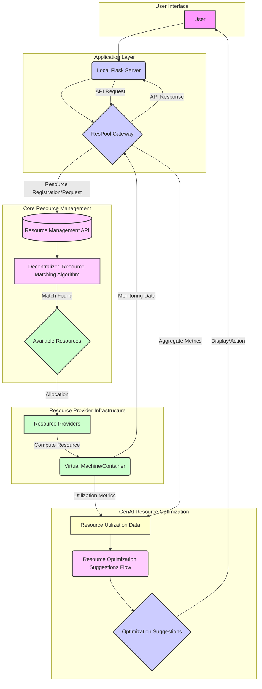

# Decentralized Cloud Gateway for Peer-to-Peer Resource Sharing

To get started, take a look at src/app/page.tsx.

## Architecture Diagram

**Explanation:**

*   **User Interface:** The user interacts with the system via a web interface, represented by "User".
*   **Application Layer:**
    *   A local Flask server handles API requests from users.
    *   It forwards these requests to the ResPool Gateway.
*   **Core Resource Management:**
    *   The ResPool Gateway provides a Resource Management API for registration and allocation requests.
    *   A decentralized resource matching algorithm finds optimal resource matches.
    *   Available resources are represented by "Available Resources."
*   **Resource Provider Infrastructure:**
    *   Resource providers contribute their resources.
    *   Compute resources are actual virtual machines or containers.
    *   Resource providers send monitoring data back to the ResPool Gateway.
*   **GenAI Resource Optimization**
    * Resource utilization data is gathered from the compute resources.
    * This data is fed into a GenAI flow which provides optimization suggestions.
    * These suggestions are returned to the user.

